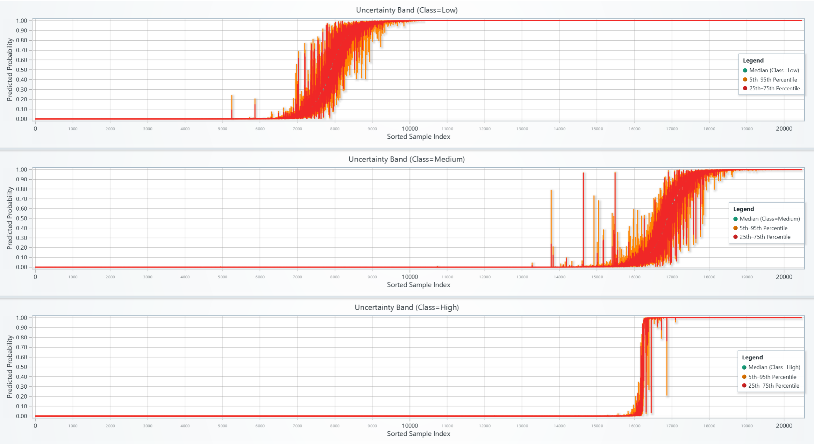
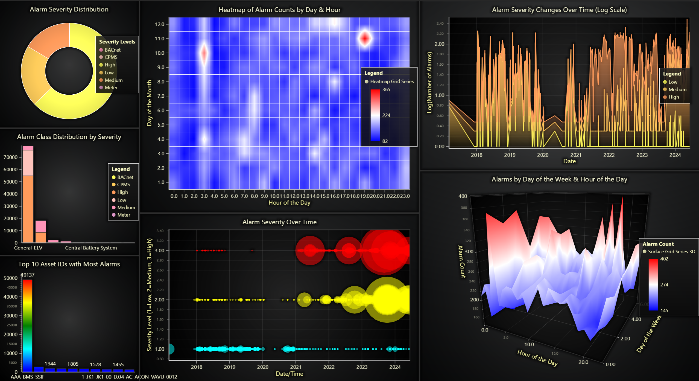

# Industrial Alarm Monitoring Application with LightningChart Python

## Introduction

In the industrial field, we always have a huge amount of data through different events like alarms. It is crucial for them to monitor these events to maintain standards, detect anomalies and keeping everything safe. This article demonstrates an industrial alarm monitoring application using LightningChart Python to visualize static and real-time streaming alarm data through different charts and dashboards.

## LightningChart Python

LightningChart Python is a powerful visualization library that is capable of visualizing real-time and interactive charts with large datasets efficiently. For this project, LightningChart provided visual insight into alarm severity, machine learning analysis and uncertainty bands through different interesting charts like line series, heatmaps, stacked bar charts, bubble charts, pie chart and 3D area chart.

## Reviewing Libraries

Several Python libraries were employed in this article:

- **Pandas**: For loading, cleaning, and structuring data..
- **NumPy**: For numerical operations.
- **Scikit-learn**: Provided machine learning tools like XGBoost for classification, SMOTE for handling imbalanced datasets, Isolation Forest for anomaly detection, and RobustScaler for data normalization.
- **LightningChart**: To create interactive visualizations.
- 
## Setting Up Python Environment
To start working on this project, we need to set up the Python environment with necessary libraries.

### Installing Python and Necessary Libraries

Before running the project, install Python and the other required libraries using:
```bash
pip install pandas numpy scikit-learn xgboost shap lightningchart smote-variants
```
### Setting Up the Development Environment
1. Set up a virtual environment:
```bash
python -m venv env
source env/bin/activate  # On Windows use `env\Scripts\activate`
```
2. Use **Visual Studio Code (VSCode)** for a streamlined development experience.

---

## Visualizing Data with LightningChart
### Creating the Charts
Here are some examples codes and charts that shows how we created key visualizations:

#### **Real-Time Alarm Prediction with XGBoost**

In the first row of dashboard, we can see real time prediction chart, it first starts predicting two values and connect them with the red line. after a few seconds it would show actual values with yellow line and at the same time model turns the old red line to orange and start predicting two new values and connecting them. In the right side we have alarm counter and below it we can see level of alarm severity. In the second row we can see the real-time certainty heatmap.

```python
xgb_model = XGBClassifier(random_state=42, use_label_encoder=False, eval_metric='logloss')
xgb_model.fit(X_train_clean, y_train_clean)
y_pred = xgb_model.predict(X_test)
```

  

#### **Ensemble Model & Uncertainty Visualization**
Here in this dashboard, we can see uncertainty chart for different classes. 

```python
seeds = [42, 123, 999, 31415, 2718]
models_list = []
for seed in seeds:
    model_ens = XGBClassifier(random_state=seed, subsample=0.8, colsample_bytree=0.8)
    model_ens.fit(X_boot, y_boot)
    models_list.append(model_ens)
```

  

#### **Exploratory Data Visualization Dashboard**

Charts in dashboard focus on showing alarm severity in different ways. We have alarm severity distribution in pie chart, stacked bar charts show alarm class distribution, heatmap demonstrates alarms by day and hour, bubble chart showing severity over time and 3D surface chart displaying alarm frequency by day of week and hour.

```python
severity_counts = df["AlarmSeverityName"].value_counts()
pie_chart.add_slices([{'name': sev, 'value': int(count)} for sev, count in severity_counts.items()])
```

  
## Conclusion

This project demonstrates how we could use LightningChart Python to visualize and monitor industrial alarm data. This approach gives us a powerful insight into system behaviors, alarm severity levels, and maintenance needs.
Benefits of LightningChart Python specifically in this project include:

- **Real-time visualization capabilities** allowing live monitoring.
- **Versatile chart options** facilitating detailed and multi-dimensional data analysis.
- **High-performance rendering** suited for complex and large datasets specially in industrial environments.

